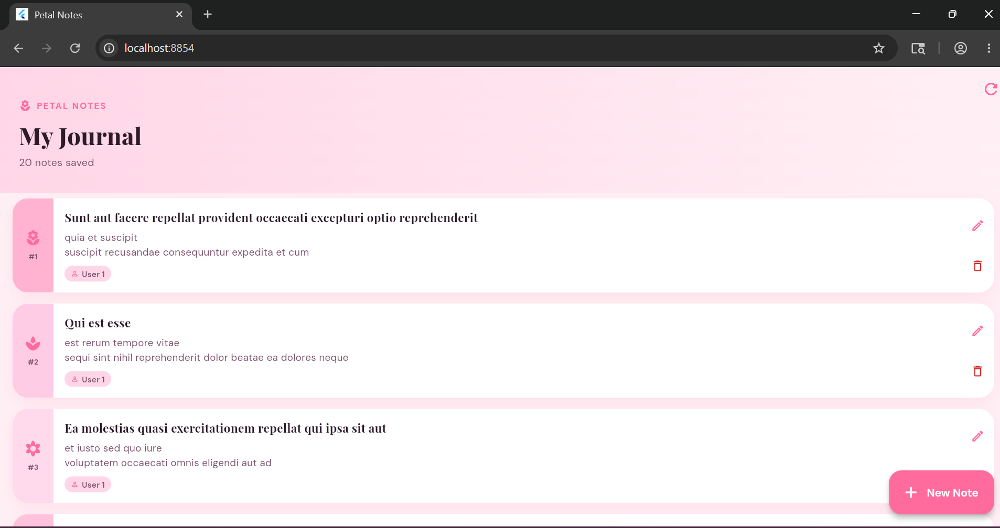
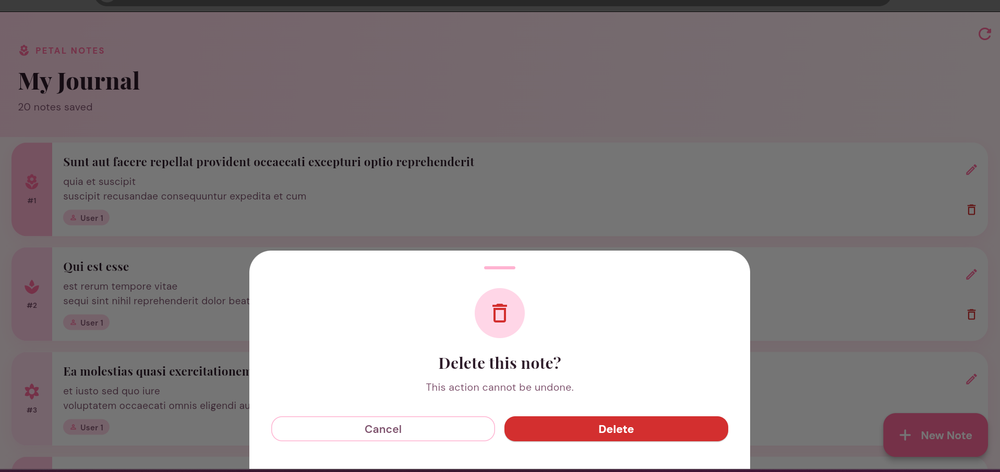
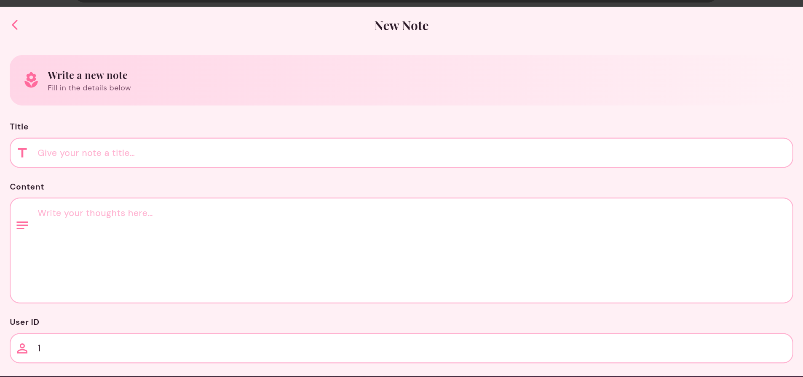
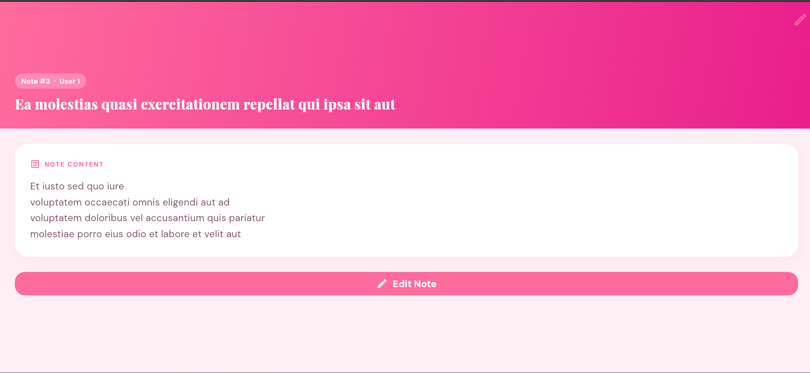
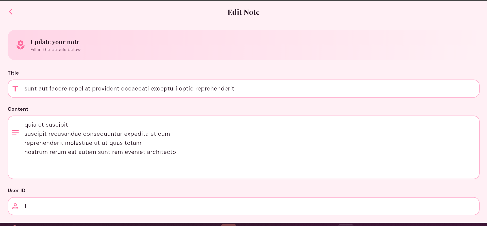
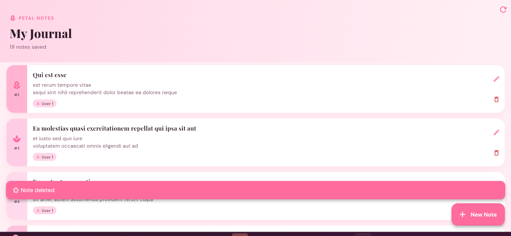

#  Petal Notes

A Flutter journaling app that performs full CRUD operations using the [JSONPlaceholder](https://jsonplaceholder.typicode.com) REST API — built with **Provider** state management and a distinctive rose-pink design.

---

##  Features

| Feature | Description |
|---|---|
|  **Create** | Add new notes via a beautiful form screen |
| **Read** | Browse all notes in a card list + tap to view detail |
|  **Update** | Edit any note's title, content, and user ID |
|  **Delete** | Remove notes with a swipe-up confirmation sheet |
|  **Pull to refresh** | Swipe down to reload notes from the API |
|  **Error handling** | Friendly error screen with retry action |
|  **Loading states** | Spinner + petal icon while fetching data |

---

##  Project Structure

```
lib/
├── main.dart                    # App entry, ChangeNotifierProvider
├── theme/
│   └── app_theme.dart           # Full pink/rose Material 3 theme
├── models/
│   └── post.dart                # Post model + JSON serialization
├── services/
│   └── api_service.dart         # All HTTP calls (CRUD)
├── providers/
│   └── post_provider.dart       # State management with ChangeNotifier
├── screens/
│   ├── home_screen.dart         # Note list with collapsing pink header
│   ├── detail_screen.dart       # Full note view with pink app bar
│   └── add_edit_screen.dart     # Create / Update form
└── widgets/
    ├── note_card.dart           # Unique card with accent stripe + icons
    └── app_widgets.dart         # PetalLoader, PetalError, PetalEmpty
```

---

##  Tech Stack

- **Flutter** (Dart)
- **Provider `^6.1.2`** — state management
- **http `^1.2.1`** — network requests
- **google_fonts `^6.2.1`** — Playfair Display + DM Sans typography
- **JSONPlaceholder** — free fake REST API

---

## Getting Started

```bash
flutter pub get
flutter run
```

> Requires Flutter 3.x and Dart ≥ 3.0.0

---

##  Screenshots

| Home | Delete Confirmation | 
|------|-------------------|
|  |  | 

| Add Product | Edit Product |
|-------------|--------------|
|  |  |


| Inside Edit | | Note Deleted|
|-------------|--------------|--------------|
|   |  |

---

##  API Reference

All requests go to `https://jsonplaceholder.typicode.com/posts`.

| Method | Endpoint | Action |
|---|---|---|
| GET | `/posts?_limit=20` | Fetch notes |
| POST | `/posts` | Create note |
| PUT | `/posts/:id` | Update note |
| DELETE | `/posts/:id` | Delete note |
## Student Information

- Name: Menal Abdulkadir
- ID: UGR/7907/16
- Section: 1